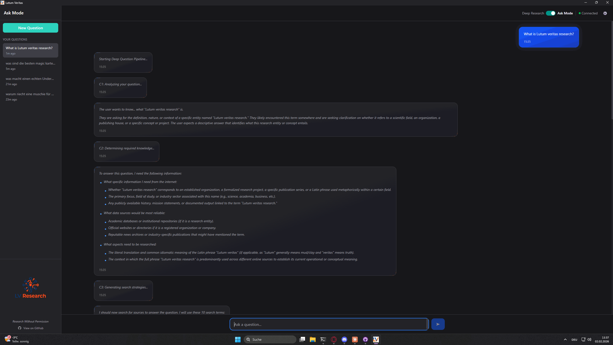

<p align="center">
  
</p>

<h1 align="center">Lutum Veritas</h1>

<p align="center">
  <strong>Open Source Deep Research Engine</strong><br>
  <em>"The search for a truth can never be worth more than the search to question it."</em>
</p>

<p align="center">
  <a href="#features">Features</a> •
  <a href="#installation">Installation</a> •
  <a href="#quick-start">Quick Start</a> •
  <a href="#how-it-works">How It Works</a> •
  <a href="#tech-stack">Tech Stack</a> •
  <a href="#license">License</a>
</p>

<p align="center">
  
  
  
  
</p>

---

<blockquote>

Perplexity, OpenAI and Google deliver summaries. I wanted truth.

So I stopped waiting and built it myself. The Camoufox scraper cuts through Cloudflare, Bloomberg and paywalls with 0% detection. The recursive pipeline passes context forward – each research point knows what the previous ones discovered. Claim Audits force the model into self-reflection instead of blind assertions.

The result: 203,000 characters of academic depth for a single query. Cost: under 20 cents. That's orders of magnitude cheaper than OpenAI o3 and qualitatively in a different league.

This isn't an "alternative" to existing tools. This is proof that a solo dev with the right architecture can beat billion-dollar corporations at what should be their core competency: deep, verifiable knowledge.

**The bar for Deep Research is set right here.**

*— Martin Gehrken, January 30, 2026*

</blockquote>

---

## Demo

<p align="center">
  
</p>

<p align="center">
  <em>Full Deep Research workflow: Query → Clarification → Plan → Research → Final Report</em>
</p>

---

## 🔬 Benchmark Results

Independent comparison of Lutum Veritas vs. ChatGPT Deep Research vs. Perplexity Pro vs. Gemini Advanced:

**[📊 View Full Benchmark Report](https://veritas-test.neocities.org/)** *(German)*
**[🌐 Auto-Translated Version (EN)](https://veritas--test-neocities-org.translate.goog/?_x_tr_sl=de&_x_tr_tl=en&_x_tr_hl=de&_x_tr_pto=wapp)** *(Google Translate)*

- 4-way comparison with identical scientific query
- Quantitative metrics: output length, sources, costs, duration
- Quality review by competing AIs
- 16-agent fact-check protocol for hallucinations

**TL;DR:** Lutum delivered 103k characters with 90 sources for $0.19. ChatGPT: 12k chars, 25 sources, fabricated citations. Gemini: 24k chars, data minimization detected. Perplexity: 21k chars, $20/mo subscription.

---

## 🏆 Thank You, Community!

<p align="center">
  
</p>

### The First 3 Days

**Released:** January 30, 2026 at 09:00
**Current:** February 2, 2026 at 13:00

**What you've accomplished:**

<p align="center">
  
  
</p>

📊 **Traffic Stats (First 3 Days):**
- 🔥 **289 Clones**
- 👀 **343 Views**
- 🎯 **11 Points on Hacker News**
- 🌍 **Featured on:** Hacker News, ComputerBase.de, Hardwareluxx, Product Hunt, DeepLearning.AI Community

---

### You Made This Possible

**In just 3 days, you've helped prove something important:**

A solo developer with an idea can stand toe-to-toe with billion-dollar companies. You don't need permission to build something great. You need passion, code, and a community that believes.

**Every star, every clone, every "this is exactly what I needed" message keeps this project going.**

You're not just users. You're proof that **Research Without Permission** isn't just a tagline - it's a movement.

**Thank you for standing against the giants.** 🚀

---

*Want to join the fight?*
⭐ **Star the repo** · 🐛 **Report issues** · 💬 **Share with your network** · 🔨 **Contribute on GitHub**

---

## What is Lutum Veritas?

**Lutum Veritas** is a self-hosted Deep Research Engine that transforms any question into a comprehensive research document. Unlike Perplexity, ChatGPT, or Google's AI Overview, you bring your own API key and everything runs locally.

### Why Use This?

| Problem | Lutum Veritas Solution |
|---------|----------------------|
| **Expensive subscriptions** | Pay only for API tokens (~$0.08 per research) |
| **Surface-level answers** | Deep multi-source analysis with 20+ sources per topic |
| **Black-box results** | See every source, every step, full transparency |
| **Bot detection blocks** | Camoufox scraper with 0% detection rate |
| **No local control** | Runs 100% on your machine |

---

## Features

### 🔬 Deep Research Pipeline

```
Your Question
     ↓
┌─────────────────────────────────────────────────────┐
│  1. CLARIFICATION                                   │
│     AI asks smart follow-up questions               │
├─────────────────────────────────────────────────────┤
│  2. RESEARCH PLAN                                   │
│     Creates structured investigation points         │
├─────────────────────────────────────────────────────┤
│  3. DEEP RESEARCH (per point)                       │
│     Think → Search → Pick URLs → Scrape → Dossier   │
├─────────────────────────────────────────────────────┤
│  4. FINAL SYNTHESIS                                 │
│     Cross-reference all findings into one document  │
└─────────────────────────────────────────────────────┘
     ↓
📄 Comprehensive Report (5,000-10,000+ words)
```

### 🎓 Academic Mode

Hierarchical research with autonomous areas:
- **Parallel Processing**: Research areas independently
- **Meta-Synthesis**: Find cross-connections between areas
- **Toulmin Argumentation**: Structured academic reasoning
- **Evidence Grading**: Rate source quality (Level I-VII)
- **Claim Audit Tables**: Confidence ratings for every claim
- **200,000+ character outputs**: Full academic depth, no shortcuts

### 🎯 Ask Mode - NEW in v1.3.0

**Quick answers. Verified facts. No hallucinations.**

<p align="center">
  
</p>

<p align="center">
  <em>Ask Mode workflow: Question → C1-C6 stages → Verified Answer with Citations</em>
</p>

The new Deep Question mode bridges the gap between chat and Deep Research. It's the tool you keep open when your question isn't "big enough" for a 20-minute deep dive, but you need more than an unverified chat response based on outdated, biased training data.

**The difference:**
- **Regular Chat**: No verification. No live search. Answers from stale training data.
- **Ask Mode**: Every answer is researched, sourced, and self-verified against a second round of sources.

**When you need a real answer on the first try: this is your mode.**

#### Features
- **6-Stage Pipeline**: Intent → Knowledge → Search → Scrape → Answer → Verify → Fact-Check (~70-90s)
- **Dual-Scraping Phases**: First scrape for answer, second scrape for verification
- **Citation System**: Inline citations [1], [2] for sources + [V1], [V2] for verification
- **Claim Auditing**: Every claim is fact-checked against additional sources
- **Auto-Language Detection**: Responds in same language as your question
- **Separate Sessions**: Ask sessions stored separately from Deep Research

#### Cost
**Cost? A joke. ~400 queries for $1.**

| Stage | Cost per Query |
|-------|----------------|
| C1: Intent Analysis | $0.000839 |
| C2: Knowledge Requirements | $0.000245 |
| C3: Search Strategy | $0.000847 |
| C4: Answer Synthesis | $0.000158 |
| C5: Claim Audit | $0.000279 |
| C6: Verification | $0.000049 |
| **Total per Query** | **~$0.0024** |

- **0.24 cents per answer**
- **416 verified answers for $1**
- Model: `google/gemini-2.5-flash-lite-preview-09-2025`

### 💻 Desktop App Features

| Feature | Description |
|---------|-------------|
| **One-Click Install** | Single installer, no separate backend needed |
| **Live Progress** | Watch research happen in real-time |
| **Session Management** | Save, rename, delete research sessions |
| **Source Boxes** | Expandable boxes showing all scraped URLs |
| **Citation Links** | Clickable `[1]` references to sources |
| **Export** | Download as Markdown or PDF |
| **Dark Mode** | System theme support |
| **i18n** | German & English interface |

### 🛡️ Zero Detection Scraping

Powered by **Camoufox** - a hardened Firefox fork that bypasses:
- Cloudflare
- DataDome
- PerimeterX
- Bloomberg, TCGPlayer, and most anti-bot systems

---

## Installation

### Option A: Download Installer (Recommended)

**Requirements:** Python 3.11+ installed ([python.org](https://python.org/downloads))

1. Download `Lutum Veritas_1.2.4_x64-setup.exe` from [Releases](../../releases)
2. Run the installer
   - If Python is not found, the installer will prompt you to install it
   - Dependencies are installed automatically via pip
3. Launch **Lutum Veritas** from your Start Menu
4. Select your **API Provider** in Settings (OpenRouter, OpenAI, Anthropic, Google Gemini, or HuggingFace)
5. Enter your API Key
6. Start researching!

> **Note:** The backend starts automatically when you open the app. No separate process to manage.

### Option B: Build from Source

**Requirements:**
- Python 3.11+
- Node.js 18+
- Rust (for Tauri)

```bash
# Clone
git clone https://github.com/IamLumae/lutum-veritas.git
cd lutum-veritas

# Backend
cd lutum-backend
pip install -r requirements.txt
python main.py

# Frontend (new terminal)
cd lutum-desktop
npm install
npm run tauri dev
```

### Option C: Install via uv (Command Line)

If you prefer command line tools and have [uv](https://github.com/astral-sh/uv) installed:

```bash
# Install as a tool
uv tool install git+https://github.com/IamLumae/lutum-veritas.git

# Run
lutum-veritas
```

Or run directly without installation (ephemeral):

```bash
uvx --from git+https://github.com/IamLumae/lutum-veritas.git lutum-veritas
```

This will start the backend server and automatically open the web interface in your browser.

---

## Quick Start

1. **Launch App** - Open Lutum Veritas (backend starts automatically)
2. **Select Provider** - Settings → Choose OpenRouter, OpenAI, Anthropic, Gemini, or HuggingFace
3. **Enter API Key** - Enter your API key for the selected provider
4. **Ask Anything** - Type your research question
4. **Answer Clarifications** - Help the AI understand your needs
5. **Review Plan** - Approve or modify the research plan
6. **Click "Let's Go"** - Watch the magic happen
7. **Export** - Download your research as MD or PDF

---

## How It Works

### Architecture

```
┌─────────────────────────────────────────────────────────────┐
│                    LUTUM VERITAS DESKTOP                     │
│  ┌───────────────────────────────────────────────────────┐  │
│  │              Tauri Shell (Rust + WebView)              │  │
│  │         Auto-starts Python backend on launch           │  │
│  │  ┌─────────────────────────────────────────────────┐  │  │
│  │  │           React Frontend (TypeScript)           │  │  │
│  │  │  • Chat Interface     • Session Management      │  │  │
│  │  │  • Live Status        • Markdown Rendering      │  │  │
│  │  └─────────────────────────────────────────────────┘  │  │
│  └───────────────────────────────────────────────────────┘  │
│                          ↕ HTTP                              │
│  ┌───────────────────────────────────────────────────────┐  │
│  │              FastAPI Backend (Python)                  │  │
│  │  • Research Orchestrator    • LLM Integration         │  │
│  │  • Session Persistence      • SSE Streaming           │  │
│  │  ┌─────────────────────────────────────────────────┐  │  │
│  │  │         Camoufox Scraper (Firefox Fork)         │  │  │
│  │  │              0% Bot Detection Rate               │  │  │
│  │  └─────────────────────────────────────────────────┘  │  │
│  └───────────────────────────────────────────────────────┘  │
└─────────────────────────────────────────────────────────────┘
```

### LLM Pipeline

| Step | Model | Purpose |
|------|-------|---------|
| Think | Gemini Flash Lite | Generate search strategies |
| Pick URLs | Gemini Flash Lite | Select best sources |
| Dossier | Gemini Flash Lite | Analyze and summarize |
| Final Synthesis | Qwen 235B | Create comprehensive report |

**Supported Providers:** [OpenRouter](https://openrouter.ai) (200+ models), [OpenAI](https://platform.openai.com), [Anthropic](https://console.anthropic.com), [Google Gemini](https://aistudio.google.com), [HuggingFace](https://huggingface.co) - bring your own API key.

---

## Tech Stack

| Component | Technology |
|-----------|------------|
| **Desktop Shell** | Tauri 2.0 (Rust) |
| **Frontend** | React 19 + TypeScript + Tailwind CSS |
| **Backend** | FastAPI (Python 3.11) |
| **Scraper** | Camoufox (Hardened Firefox) |
| **LLMs** | Multi-Provider (OpenRouter, OpenAI, Anthropic, Gemini, HuggingFace) |
| **Database** | File-based JSON (sessions) |

---

## Project Structure

```
lutum-veritas/
├── lutum/                      # Core Python library
│   ├── researcher/
│   │   └── prompts/            # LLM prompts (Think, Pick, Dossier, Synthesis)
│   └── scrapers/
│       └── camoufox_scraper.py # Zero-detection web scraper
├── lutum-backend/              # FastAPI server
│   └── routes/
│       └── research.py         # Research pipeline orchestrator
├── lutum-desktop/              # Tauri desktop app
│   ├── src/
│   │   ├── components/         # React components
│   │   ├── hooks/              # useBackend API hook
│   │   └── stores/             # Session state management
│   └── src-tauri/
│       ├── src/lib.rs          # Auto-start backend logic
│       └── nsis-hooks.nsh      # Installer: Python check + pip install
├── LICENSE                     # AGPL-3.0
├── NOTICE                      # Copyright & commercial licensing
└── README.md                   # You are here
```

---

## API Reference

### Endpoints

| Endpoint | Method | Description |
|----------|--------|-------------|
| `/health` | GET | Backend health check |
| `/research/overview` | POST | Initial analysis & clarification questions |
| `/research/plan` | POST | Generate research plan |
| `/research/plan/revise` | POST | Modify plan based on feedback |
| `/research/deep` | POST | Execute deep research (SSE stream) |
| `/research/academic` | POST | Execute academic research (SSE stream) |

### SSE Events (Deep Research)

```javascript
// Status updates
{"type": "status", "message": "Searching Google..."}

// Sources found
{"type": "sources", "urls": ["https://...", "https://..."]}

// Point completed
{"type": "point_complete", "point_title": "...", "key_learnings": "..."}

// Synthesis starting
{"type": "synthesis_start", "dossier_count": 5, "total_sources": 45}

// Research complete
{"type": "done", "data": {"final_document": "...", "source_registry": {...}}}
```

---

## Cost Comparison

Real benchmark: 513k input tokens, 55k output tokens

| Service | Cost | vs Lutum |
|---------|------|----------|
| **Lutum Veritas** | **$0.08** | - |
| ChatGPT Plus | $20/mo | Subscription |
| Perplexity Pro | $20/mo | Subscription |
| OpenAI o3 | $7.36 | 92x more |
| OpenAI o4-mini | $1.44 | 18x more |
| Google Gemini Pro | $2.95 | 37x more |

---

## Contributing

Contributions are welcome! Please:

1. Fork the repository
2. Create a feature branch (`git checkout -b feature/amazing`)
3. Commit your changes (`git commit -m 'Add amazing feature'`)
4. Push to the branch (`git push origin feature/amazing`)
5. Open a Pull Request

### Development Setup

```bash
# Backend (with hot reload)
cd lutum-backend
uvicorn main:app --reload --port 8420

# Frontend (with hot reload)
cd lutum-desktop
npm run tauri dev
```

---

## License

**Lutum Veritas** is licensed under the [GNU Affero General Public License v3.0](LICENSE).

This means:
- ✅ Free to use, modify, and distribute
- ✅ Commercial use allowed
- ⚠️ Must disclose source code (including SaaS)
- ⚠️ Modifications must use same license

### Commercial Licensing

Need to use Lutum Veritas without AGPL obligations? Commercial licenses are available.

**Contact:** iamlumae@gmail.com

---

## Security

**v1.3.0 Installer:**
- **VirusTotal**: [0/65 detections](https://www.virustotal.com/gui/file/96faa40b63150632a96486086a2a778a4ec8a19b31dd06907d5178bb961fc287?nocache=1) ✅ **Clean**
- **SHA256**: `96faa40b63150632a96486086a2a778a4ec8a19b31dd06907d5178bb961fc287`

---

## Acknowledgments

- [Camoufox](https://github.com/nicholaslazooffers/camoufox) - The magic behind zero-detection scraping
- [Tauri](https://tauri.app) - Lightweight desktop app framework
- [OpenRouter](https://openrouter.ai) - Unified LLM API access

---

<p align="center">
  <strong>Built with obsessive attention to detail</strong><br>
  <em>Because truth shouldn't be locked behind paywalls</em>
</p>

<p align="center">
  <a href="https://github.com/IamLumae">@IamLumae</a>
</p>
